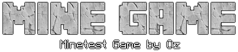

# Mine Game
Mine game, use the [Minetest](https://github.com/minetest/minetest) game engine.

The name of the game makes a word play with both meanings of mine, the mining
component of the game and the fact that this specific version of the game is
mine.

I started to used the modified version of the game by PetiAPocok 
[Minetest Extended](https://github.com/PetiAPocok/minetest_extended), I really
liked what he do with some mods and the core of the game.
Some things still needs changes, and some changes i didnt liked, so is a mix of
a lot of sources.

# Why
There are a lot of things that i loved of minetest and its mods, but also a
lot of things that i hated, the ggod thing about open source is that i can 
change the game as i wants... so that is what im doing.

# Changes

This mods are included from _minetest_extended_ without changes:
- 3d Armor with sfinv, stand and shields 
- Backpacks
- Bones, this version is mixed with bonemeal
- sfinv

This mods are included from the oficial [_minetest_game_](https://github.com/minetest/minetest_game):
- Beds
- Boats
- Default

This ones are my own changes:
- Mix the official Bucket mod with [wooden_bucket](https://gitlab.com/h2mm/wooden_bucket)

# Images
The logos and images were made with [TextCraft](https://textcraft.net) hoping
not breaking any copyright, but maybe I change the images for some created 
(or purchased) by me.

# License
The individual mods and games belongs to their owners with its own licence 
restrictions. 

The code writen by me is published under the Unlicence, see LICENSE.txt
I think that the knowledge is free and belongs to the world.
